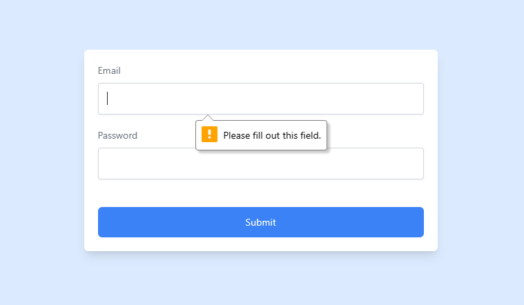

# Adding Custom Validation To a Form With TailwindCSS

_**Prerequisites:** This article assumes you have tailwindcss set up in an existing project. If that's not the case, follow this [guide](https://tailwindcss.com/docs/installation) to set one up like it was done for this article._


## Introduction

In this article, we will be looking at how to add custom validation to a form with TailwindCSS. The form is a simple html form and can be used on any project that uses TailwindCSS.

## Basic Form Structure

The form is a simple login form with a two input fields and a submit button with added styles from tailwind.

```html
<main class="min-h-screen bg-blue-100 flex items-center justify-center text-gray-500 text-sm">
  <form
    class="bg-white shadow-lg rounded-md p-5 md:p-10 flex flex-col w-11/12 max-w-lg"
  >
    <label for="email" class="mb-5">
      <span>Email</span>
      <input
        type="email"
        name="email"
        id="email"
        class="w-full rounded border border-gray-300 bg-inherit p-3 shadow shadow-gray-100 mt-2 appearance-none outline-none text-neutral-800"
        placeholder=" "
        required
      />
    </label>
    <label for="password" class="mb-5">
      <span>Password</span>
      <input
        type="password"
        name="password"
        id="password"
        class="w-full rounded border border-gray-300 bg-inherit p-3 shadow shadow-gray-100 mt-2 appearance-none outline-none text-neutral-800"
        placeholder=" "
        required
      />
    </label>
    <button type="submit" class="mt-5 bg-blue-500 py-3 rounded-md text-white">Submit</button>
  </form>
</main>
```

In our form, we have two required input fields and a submit button. Whenever you add the `required` attribute to input fields it shows an error like the one below when you try to submit it without completing the fields.



This popup message is not very appealing, varies from browser to browser, and cannot be customized. We will be looking at how to customize this message to suit our needs.

## Disabling the Default Validation Message

To disable the default validation message, we will be using the `novalidate` attribute on the form. This attribute will disable the default validation message and allow us to add our own custom validation message.

```html
<!-- ... -->
<form
  class="bg-white shadow-lg rounded-md p-5 md:p-10 flex flex-col w-11/12 max-w-lg"
  novalidate
>
<!-- ... -->
```

## Adding Custom Validation To Input Fields

In CSS, we can use the `:invalid` pseudo-class to style an input field when it is invalid. Tailwind also makes it available to us. We would add a red border to the input field when it is invalid. We can also add a regex pattern to the input field to force a certain style.

```html
<!-- ... -->
<label for="email" class="mb-5">
  <span>Email</span>
  <input
    type="email"
    name="email"
    id="email"
    class="... invalid:[&:not(:placeholder-shown):not(:focus)]:border-red-500"
    placeholder=" "
    required
    pattern="[a-z0-9._%+-]+@[a-z0-9.-]+\.[a-z]{2,}$"
  />
</label>
<label for="password" class="mb-5">
  <span>Password</span>
  <input
    type="password"
    name="password"
    id="password"
    class="... invalid:[&:not(:placeholder-shown):not(:focus)]:border-red-500"
    placeholder=" "
    required
    pattern=".{7,}"
  />
</label>
<!-- ... -->
```

For the email field, we are using a standard regex pattern that checks for a valid email address.

For the password field, we are using a regex pattern that checks for a password with a minimum of 7 characters.

We chained some tailwind classes to the `invalid` class to style the input field when it is invalid. Let's break this down.

- We are making using of [Arbitrary variants](https://tailwindcss.com/docs/hover-focus-and-other-states#using-arbitrary-variants) to add a custom modifiers to the `invalid` class.
- :not(:placeholder-shown) - This will make sure that the input field is not empty. If the input field is empty, we don't want to show the red border. Hence, why we are using a space in the placeholder. You can decide to use text like "Enter your email" in the placeholder.
- :not(:focus) - This will make sure that the input field is not focused. If the input field is focused, we don't want to show the red border.


## Adding Custom Validation Message

To add a custom validation message, we will be using the `peer` class. The `peer` class allows us to style an element based on the state of another element. In this case, we will be styling the span element based on the state of the input field.

```html
<!-- ... -->
<label for="email" class="mb-5">
  <span>Email</span>
  <input
    type="email"
    name="email"
    id="email"
    class="... peer"
    placeholder=" "
    required
    pattern="[a-z0-9._%+-]+@[a-z0-9.-]+\.[a-z]{2,}$"
  />
  <span class="mt-2 hidden text-sm text-red-500 peer-[&:not(:placeholder-shown):not(:focus):invalid]:block">
    Please enter a valid email address
  </span>
</label>
<!-- ... -->
```

We added the `peer` class to the input field, and then chained the `peer` class to the arbitrary variants we used for the input field to change span element from `display: none` to `display: block` when the input field is invalid.

Now, we've add custom validation styles and messages to our form. But, we can still submit the form without filling the fields or when they're invalid. We will be looking at how to prevent the form from being submitted when the fields are empty.

## Preventing Form Submission

To prevent the form from being submitted when the fields are empty or invalid, we will be using the `group` class on the form. Similar to the `peer` class, the `group` class allows us to style an element based on the state of the parent element. 

Since the input fields are nested inside the form, when any of the input fields are invalid, the form will be invalid. We can use this to disable the button and prevent the form from being submitted.

```html
<!-- ... -->
<form
  class="... group"
  novalidate
>
<!-- ... -->
<button type="submit" class="... group-invalid:pointer-events-none group-invalid:opacity-30">Submit</button>
</form>
<!-- ... -->
```

We make use if the pseudo-class `:invalid` to style the button when the form is invalid. We also chained the `group-invalid` class to the `pointer-events-none` and `opacity-50` classes to disable the button and make it more transparent when the form is invalid.


## Finished Look

<video autoplay loop muted width="600" height="400" src="./src/assets/demo.mp4">

</video>


## Conclusion

Tailwind makes it easy to add custom validation styles and messages to our forms without JavaScript. We can also use JavaScript to add more functionality to our forms. I hope you enjoyed this tutorial. If you have any questions, feel free to ask in the comments section below.

You can find the code for this tutorial on [GitHub](https://github.com/deyemiobaa/tailwindcss_custom_form_validation)

## Resources

- [Tailwind CSS: Hover, Focus, and Other States](https://tailwindcss.com/docs/hover-focus-and-other-states)
